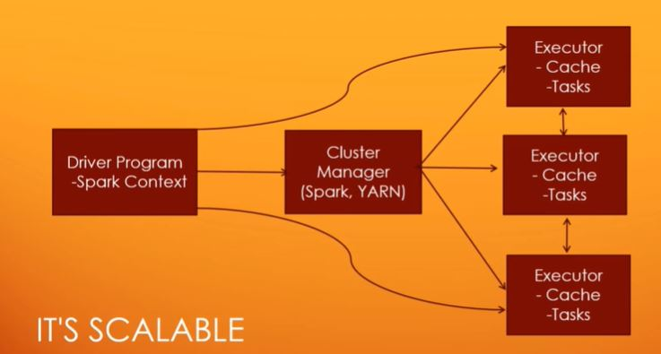
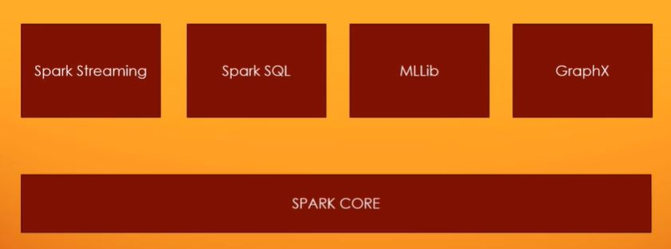

# Apache Spark

## What is Apache Spark?
Apache spark is fast and general engine for large-scale data processing. Apache spark is very scalable. 

## What is the high level architecture of Apache Spark?
The high level architecture of spark can be seen in the following figure

To use Spark, anyone can simply write the simple script using Python or Scala (just example) to describe how to transform and process a huge amount of data and Spark will figure out how to distribute that work across an entire cluster of the computers. Cluster manager is needed to manage the distributed machine. This cluster manager can be Hadoop or the spark itself has it's own cluster manager. In individual machine there are executor that has it's own cache and task that is trying to operate on the data. Everything is connected. The driver program sends out commands to the cluster manager and also directly to the executors when needed. And the executors are talking to each other and synchronizing amongst themselves. And of course the cluster manager is talking to all of those executor processes as well, trying to orchestrate what gets run, where, and then call lighting those results back together to give you your final result when it's all done.

## Why Apache Spark is so popular?

### It's fast
- Run programs up to 100x faster than Hadoop MapReduce in memory, 10x faster on disk
- DAG (directed acyclic graph) optimize the workflows

### It's not that hard
- Code in Python, Java, Scala or R
- Spark has SparkSQL where it can make developer easier to use since SQL is so popular
- Lower level API is available too. We called it as Resilient Distributed Database or RDD in short

## Apache Spark Component
Here is the component of the Apache Spark

Spark Core: It's a place where RDD lives. The base of underlying Spark engine itself.

Spark Streaming: Powerful technology for ingesting data near in the real time. 

Spark SQL: Integrate Spark with SQL command! You can imagine Spark like a giant database that's distributed in nature. 

MLLib: The libraries for doing the machine learning in the top of Spark

GraphX: It's more graphs in the computer science sense.
So we're talking about like networks of information,
for example, a social network where you have users
that are connected to other users is a graph in that sense.
And GraphX can do things like, analyze those graphs of information, tell you attributes about it and let you into a sort of iterate through those in a distributed manner.

## Some Useful Resources
- [What is Apache Spark in Data Analythics?](https://medium.com/@loginwork/what-is-apache-spark-in-data-analytics-fc2ded8a492b)
- [Apache Spark Ecosystem — Complete Spark Components Guide](https://medium.com/@rinu.gour123/apache-spark-ecosystem-complete-spark-components-guide-f3b57893173e)
- [High Level Overview of Apache Spark](https://medium.com/better-programming/high-level-overview-of-apache-spark-c225a0a162e9)